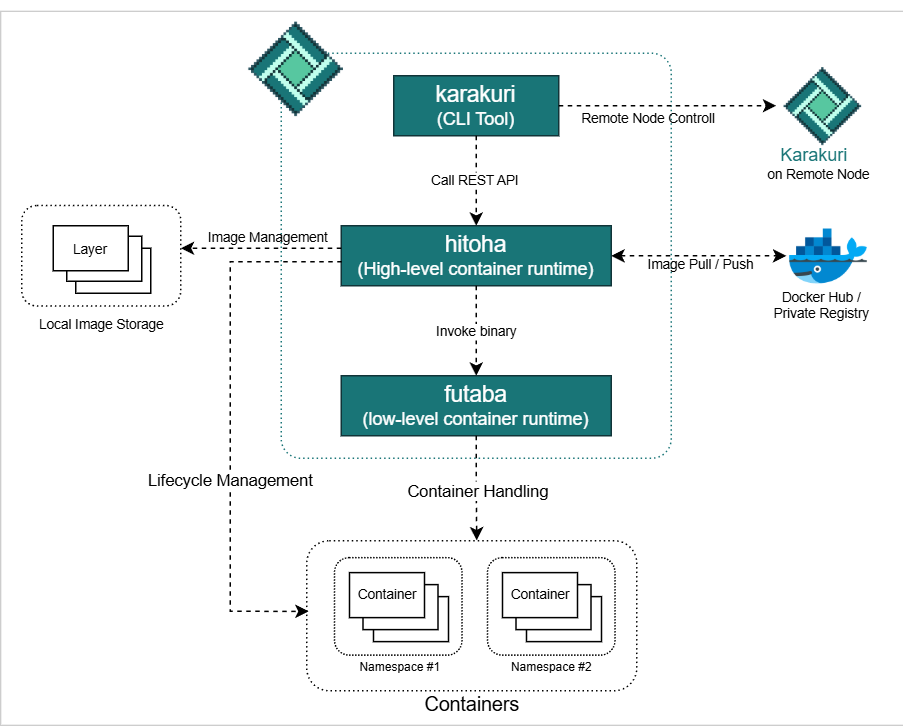

# 


## Introduction
`karakuri` is a container runtime for small-scale development environments.  
`karakuri` provides the following features.
* Management of container lifecycle, including creation, running, and removal
* Support for image pulling from Docker Hub and Private Registry
* Support for image pushing to Priavte Registry
* Support for image build
* Resourcce limitation of containers by cgroup v2
* Container grouping and isolation network by namespace
* Management and execution of core functions (e.g. dns, ingress, etc) through module functionality
* Connecting to remote node and managing container
* Connecting to the Registry and Repository/Tag Management

## Components
`karakuri` consists of three components.
1. `karakuri`  
   A CLI tool that provides the ability to send requests to high-level container runtime.
1. `hitoha`  
   High-level container runtime.  
   Runs as a daemon process and performs container networking, lifecycle management and image management.  
   `hitoha` provides a REST API as an interface and executes low-level container runtime in response to received requests.  
   In addition, `hitoha` will provide add-on functions such as module functions and registry connection functions.
1. `futaba`  
   Low-level container runtime.  
   `futaba` provides actual container operation, including namespace isolation, mounts, root filesystem changes, etc.



## Building
### Pre-requisites
Before building `karakuri`, must install some utilitis.  
On Ubuntu/Debian:  
```
$ snap install go --classic
$ apt update && apt install -y cgroup-tools iptables
```

### Build
```
$ git clone https://github.com/pyxgun/karakuri.git
$ cd karakuri

$ sh scripts/build.sh
```

### Test Run
```
$ sudo karakuri run --rm --it --image hello-world

Hello from Docker!
This message shows that your installation appears to be working correctly.
   :
```

## Quick Start: Container Operation
The following is how to run container lifecycle.  
### Pull image (Optional)
Retrieve an image from registry.
This operation is optional because if an image that doesn't exist local is specified when `create` command is executed, the image is automatically retrieved.
```
$ sudo karakuri pull --image alpine
```
Check the local image list.
```
$ sudo karakuri images

REPOSITORY      | TAG           | ID
----------------+---------------+-----------------
alpine          | latest        | b0c9d60fc5e3
```

### Create container
Create a container.
```
$ sudo karakuri create --name mycontainer --image alpine
```
Check container list.
```
$ sudo karakuri ls

CONTAINER ID | Name        | IMAGE  | STATUS  | PORT | COMMAND
-------------+-------------+--------+---------+------+---------------
52e579b39313 | mycontainer | alpine | created |      | /bin/sh                         
```

### Start container
Start the container.
```
$ sudo karakuri start --name mycontainer --it

/ # 
```
`--it` option is specified when executing commands that require standard output, such as shell and other interactive tools.

### Delete container
Delete the container
```
$ sudo karakuri rm --name mycontainer
```

## Quick Start: Image Operation
You can manage the local image storage.
### Show image
```
$ sudo karakuri images

REPOSITORY    | TAG       | ID
--------------+-----------+-----------------
python        | alpine    | 6cf03fe1f23a
nginx         | alpine    | d41a14a4ecff
alpine        | latest    | b0c9d60fc5e3
```

### Delete Image
```
$ sudo karakuri rmi --id [IMAGE_ID]
```

## More Operation
* [Examples create container](./docs/example_container_creation.md) - Some examples on container creation
* [Node Controller](./docs/node_controller.md) - Manage `karakuri` remotely
* [Registry Contrroller](./docs/registry_controller.md) - Manage private registry

## Specification Documents
* [Command List](./docs/command_list.md) - `karakuri` Command list
* [Container Specification](./docs/container_spec.md) - Specifications of containers operated by `Karakuri`

## License
The code and docs are released under the [MIT license](LICENSE).