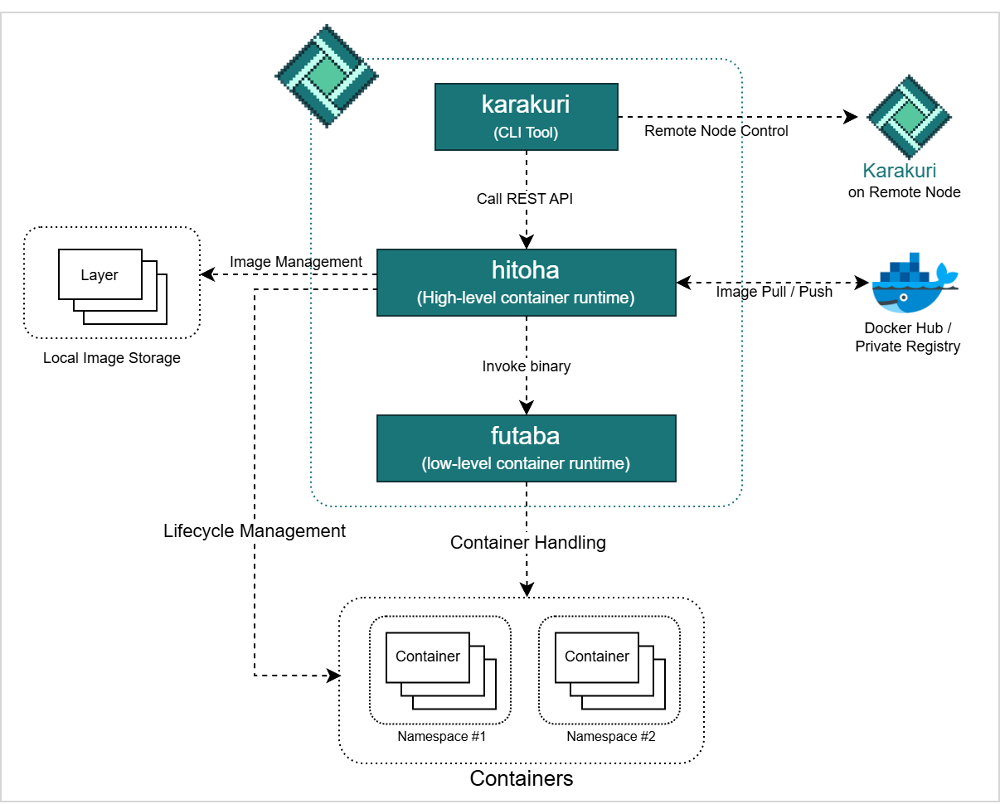

# 


## Introduction
`karakuri` is a container runtime for small-scale development environments.  
`karakuri` provides the following features.
* Management of container lifecycle, including creation, running, and removal
* Support for image pulling from Docker Hub and Private Registry
* Support for image pushing to Priavte Registry
* Support for image build
* Resourcce limitation of containers by cgroup v2
* Container grouping and isolation network by namespace
* Management and execution of core functions (e.g. dns, ingress, etc) through module functionality
* Connecting to the Registry and Repository/Tag Management

## Components
`karakuri` consists of three components.
1. `karakuri`  
   A CLI tool that provides the ability to send requests to high-level container runtime.
1. `hitoha`  
   High-level container runtime.  
   Runs as a daemon process and performs container networking, lifecycle management and image management.  
   `hitoha` provides a REST API as an interface and executes low-level container runtime in response to received requests.  
   In addition, `hitoha` will provide add-on functions such as module functions and registry connection functions.
1. `futaba`  
   Low-level container runtime.  
   `futaba` provides actual container operation, including namespace isolation, mounts, root filesystem changes, etc.



## Building
### Pre-requisites
Before building `karakuri`, must install some utilitis.  
On Ubuntu/Debian:  
```
$ snap install go --classic
$ apt update && apt install -y cgroup-tools iptables
```

### Build
```
$ git clone https://github.com/pyxgun/karakuri.git
$ cd karakuri

$ sh scripts/build.sh
```

### Test Run
```
$ sudo karakuri run --rm --it --image hello-world

Hello from Docker!
This message shows that your installation appears to be working correctly.
   :
```

## Container Operation
The following is how to run container lifecycle.  
### Pull image (Optional)
Retrieve an image from registry.
This operation is optional because if an image that doesn't exist local is specified when `create` command is executed, the image is automatically retrieved.
```
$ sudo karakuri pull --image=alpine
```
Check the local image list.
```
$ sudo karakuri images

REPOSITORY      | TAG           | ID
----------------+---------------+-----------------
alpine          | latest        | b0c9d60fc5e3
```

### Create container
Create a container.
```
$ sudo karakuri create --name=mycontainer --image=alpine
```
Check container list.
```
$ sudo karakuri ls

CONTAINER ID | Name        | IMAGE  | STATUS  | PORT | COMMAND
-------------+-------------+--------+---------+------+---------------
52e579b39313 | mycontainer | alpine | created |      | /bin/sh                         
```

### Start container
Start the container.
```
$ sudo karakuri start --name=mycontainer --it

/ # 
```
`--it` option is specified when executing commands that require standard output, such as shell and other interactive tools.

### Delete container
Delete the container
```
$ sudo karakuri rm --name=mycontainer
```

## Image Operation
### Show image
```
$ sudo karakuri images

REPOSITORY    | TAG       | ID
--------------+-----------+-----------------
python        | alpine    | 6cf03fe1f23a
nginx         | alpine    | d41a14a4ecff
alpine        | latest    | b0c9d60fc5e3
```

### Delete Image
```
$ sudo karakuri rmi --id [IMAGE_ID]
```


## Registry Controller
If you have enabled `registry` module or have your own private registry, you can connect to it.  
You can check the repository and tags of the connected registry, push/pull images, and delete images.  
  
It is not connected to any registry by default. The following commands can be used to connect to the registry.
```
$ sudo karakuri regctl connect --registry [REGISTRY]
```
The registry to be connected and the connection status can be checked with the following command.
```
$ sudo karakuri regctl target

Registry : 172.17.20.150:5000
Status   : connected
```

### Get Repositories/Tags list
Get repositories:
```
$ sudo karakuri regctl get repository

REPOSITORY
--------------------------
alpine
ubuntu
nginx
```
Get tags:
```
$ sudo karakuri regctl get tag --repository alpine

REPOSITORY: alpine
TAG
--------------
3.20
3.21
latest
```

### Push Image
If you are connected to a registry, `karakuri push` command will automatically push the image to the connected registry.  
```
$ karakuri push --image ubuntu:24.04

Pushing image, ubuntu:24.04 ...
Push completed
```
(Optional) If you are not connected to a registry, you must specify a registry to push with `--registry [REGISTRY]` option.

### Delete Image
```
$ sudo karakuri regctl delete --image ubuntu:24.04

delete alpine:3.20 success.
```

### Change the connection registry
Before changing the registry to which you are connecting, you must disconnect from the currently connected registry with the following command:
```
$ sudo karakuri regctl disconnect

registry dissconnected.

$ sudo karakuri regctl target
Registry : 172.17.20.150:5000
Status   : disconnected
```
Then connect to new registry with the following command:
```
$ sudo karakuri connect --registry [NEW_REGISTRY]
```


## More documentation
* [Command List](./docs/command_list.md)
* [Container Specification](./docs/container_spec.md)

## License
The code and docs are released under the [MIT license](LICENSE).